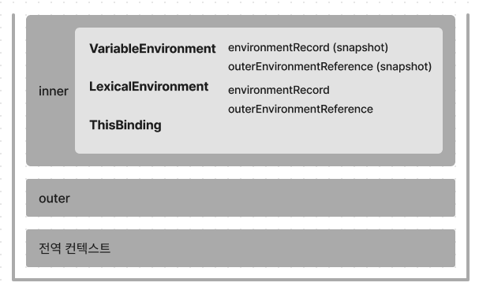

# 02. 실행 컨텍스트

## 01. 실행 컨텍스트란?

- 실행할 코드에 제공할 환경 정보들을 모아놓은 객체
- 컨텍스트를 구성하고, 이를 콜 스택에 쌓아올렸다가, 가장 위에 쌓여있는 컨텍스트와 관련 있는 코드들을 실행하는 식으로 전체 코드의 환경과 순서를 보장
- ‘동일한 환경’, 즉 하나의 실행 컨텍스트를 구성할 수 있는 방법: 전역공간, eval() 함수, **함수** 등
    - 우리가 흔히 실행 컨텍스트를 구성하는 방법은 **함수를 실행**하는 것
- 활성화된 실행 컨텍스트의 수집 정보
    - **VariableEnvironment**: 현재 컨텍스트 내의 식별자들에 대한 정보 + 외부 환경 정보.
        
        선언 시점의 LexicalEnvironment의 스냅샷으로, 변경 사항은 반영되지 않음.
        
    - **LexicalEnvironment**: 처음에는 VariableEnvironment와 같지만 변경 사항이 실시간으로 반영됨.
    - **ThisBinding**: this 식별자가 바라봐야 할 대상 객체.



<br />

## 02. VariableEnvironment

- 실행 컨텍스트를 생성할 때 VariableEnvironment에 정보를 먼저 담은 다음, 이를 그대로 복사해서 LexicalEnvironment를 만들고, 이후에는 LexicalEnvironment를 주로 활용

<br />

## 03. LexicalEnvironment

### 2-3-1 environmentRecord와 호이스팅

- environmentRecord: 현재 컨텍스트와 관련된 코드의 식별자 정보들이 저장
    - 매개변수 식별자, 선언된 함수, var로 선언된 변수의 식별자 등
- 자바스크립트 엔진은 식별자들을 최상단으로 끌어올려놓은 다음 실제 코드를 실행한다.

### **호이스팅 규칙**

[매개변수와 변수에 대한 호이스팅 - 원본 코드]

```jsx
function a (x) {     // 수집 대상 1(매개변수)
	console.log(x);    // (1)
	var x;             // 수집 대상 2(변수 선언)
	console.log(x);    // (2)
	var x = 2;         // 수집 대상 3(변수 선언)
	console.log(x);    // (3)
}
a(1);
```

[매개변수와 변수에 대한 호이스팅 - 호이스팅을 마친 상태]

```jsx
function a (x) {
	var x;             // 수집 대상 1의 변수 선언 부분
	var x;             // 수집 대상 2의 변수 선언 부분
	var x;             // 수집 대상 3의 변수 선언 부분
	
	x = 1;             // 수집 대상 1의 할당 부분
	console.log(x);    // (1) 1
	console.log(x);    // (2) 1
	x = 2;             // 수집 대상 3의 할당 부분
	console.log(x);    // (3) 2
}
a(1);
```

[함수 선언의 호이스팅 - 원본 코드]

```jsx
function a () {
	console.log(b);     // (1)
	var b = 'bbb';      // 수집 대상 1(변수 선언)
	console.log(b);     // (2)
	function b() {}     // 수집 대상 2(함수 선언)
	console.log(b);     // (3)
}
a();
```

[함수 선언의 호이스팅 - 호이스팅을 마친 상태]

```jsx
function a () {
	var b;             // 수집 대상 1(변수는 선언부만 끌어올립니다.)
	function b() {}    // 수집 대상 2(함수 선언은 전체를 끌어올립니다.)
	
	console.log(b);    // (1) b함수
	b = 'bbb';
	console.log(b);    // (2) bbb
	console.log(b);    // (3) bbb
}
a();
```

### 함수 선언문과 함수 표현식

```jsx
// 함수를 표현하는 세 가지 방식
function a () {/* ... */}          // 함수 선언문. 함수면 a가 곧 변수명.
a(); // 실행 OK

var b = function () {/* ... */}    // (익명)함수 표현식. 변수명 b가 곧 함수명.
b(); // 실행 OK

var c = function d () {/* ... */}  // 기명 함수 표현식. 변수명은 c, 함수명은 d.
c(); // 실행 OK
d(); // 에러!
```

[함수 선언문과 함수 표현식 - 원본 코드]

```jsx
console.log(sum(1, 2));
console.log(multiply(3, 4));

function sum(a, b) {               // 함수 선언문 sum
	return a + b;
}

var multiply = function(a, b) {    // 함수 표현식 multiply
	return a + b;
}
```

[함수 선언문과 함수 표현식 - 호이스팅을 마친 상태]

```jsx
var sum = function sum(a, b) {   // 함수 선언문은 전체를 호이스팅합니다.
	return a + b;
}

var multiply;                    // 변수는 선언부만 끌어올립니다.
console.log(sum(1, 2));
console.log(multiply(3, 4));

multiply = function(a, b) {      // 변수의 할당부는 원래 자리에 남겨둡니다.
	return a * b;
};
```

### 2-3-1 스코프, 스코프 체인, outerEnvironmentReference

- 스코프: 식별자에 대한 유효범위

### 스코프 체인

- outerEnvironmentReference는 현재 호출된 함수가 **선언될 당시**의 LexicalEnvironment를 참조
- ‘선언하다’는 행위가 실제로 일어날 수 있는 시점이란 콜 스택 상에서 어떤 실행 컨텍스트가 활성화된 상태일 때뿐
- 여러 스코프에서 동일한 식별자를 선언한 경우에는 무조건 스코프 체인 상에서 가장 먼저 발견된 식별자에만 접근 가능

### 전역변수와 지역변수

- 전역 공간에서 선언한 변수는 전역변수이고, 함수 내부에서 선언한 변수는 무조건 지역변수

<br />

## 04. this

- 실행 컨텍스트의 thisBinding에는 this로 지정된 객체가 저장
- 실행 컨텍스트 활성화 당시에 this가 지정되지 않은 경우 this에는 전역 객체가 저장
